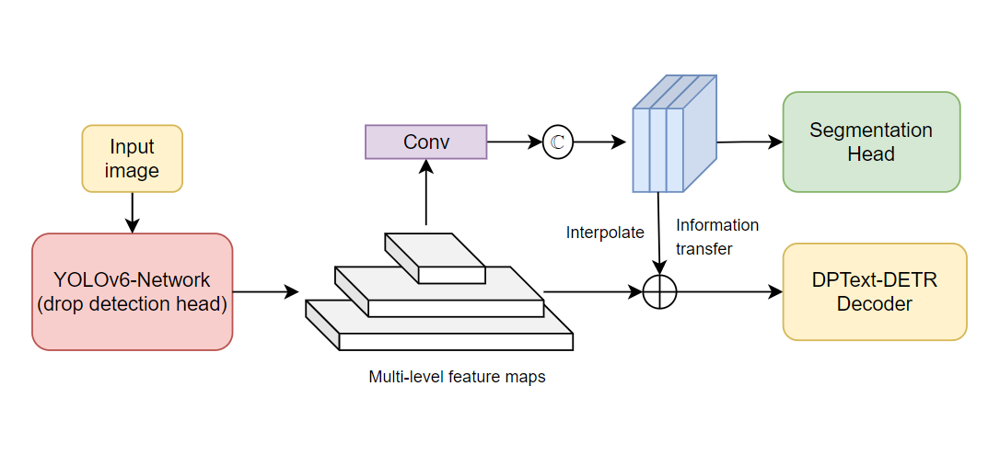

<h1 align="center"> Combine YOLOv6 and DPText-DETR for real time text detection </h1> 

## Introduction

Outstanding results on the benchmark for text detection are achieved by DPText-DETR. However, it is unable to perform real-time inference. In order to accomplish real-time text detection, I integrated [YOLOv6](https://github.com/meituan/YOLOv6), a quick and high-performance object detection network, with [DPText-DETR](https://github.com/ymy-k/DPText-DETR). Additionally, ROIAlign is employed to improve the decoder's query embedding, and a lightweight segmentation head is created to support multitask learning for even more accuracy increase.

## Proposed Architecture



## Experimental Results

|Benchmark|Backbone|Precision|Recall|F-measure|Fine-tuned Model|
|:------:|:------:|:------:|:------:|:------:|:------:|
|Total-Text|Yolov6-N|90.4|77.9|83.6|[Google Drive](https://drive.google.com/file/d/1GN2p1asuJhd5cdRBB2bl3iLzynQJUMr5/view?usp=sharing)|

## Usage

It's recommended to configure the environment using Anaconda. Python 3.8 + PyTorch 1.9.1 (or 1.9.0) + CUDA 11.1 + Detectron2 (v0.6) are suggested.

- ### Installation
```
conda create -n YoloTransformer python=3.8 -y
conda activate YoloTransformer
pip install torch==1.9.1+cu111 torchvision==0.10.1+cu111 -f https://download.pytorch.org/whl/torch_stable.html
pip install opencv-python scipy timm shapely albumentations Polygon3
python -m pip install detectron2 -f https://dl.fbaipublicfiles.com/detectron2/wheels/cu111/torch1.9/index.html
pip install setuptools==59.5.0
git clone https://github.com/trinhxuankhai/YoloTransformer.git
cd YoloTransformer
python setup.py build develop
pip install addict
```

- ### Training

**Fine-tune:**
Yolov6-N network is being used in the fine-tuning model to replace the DPText-DETR encoder. When compared to the original DPText-DETR, the inference speed is tested to be 2–3 times faster, but the precision and recall are less accurate. The model is optimized with a batch size of four using one GPU on Colab. More performance is expected when the batch size is increased and the model is pre-trained additionally on synthetic text dataset. Trainning example:

```
python tools/train_net.py --config-file configs/DPText_DETR/TotalText/R_50_poly.yaml --num-gpus 1
```

More detail on trainning and dataset preparation can be refered to [DPText-DETR](https://github.com/ymy-k/DPText-DETR).

## Citation

```bibtex
@inproceedings{ye2022dptext,
  title={DPText-DETR: Towards Better Scene Text Detection with Dynamic Points in Transformer},
  author={Ye, Maoyuan and Zhang, Jing and Zhao, Shanshan and Liu, Juhua and Du, Bo and Tao, Dacheng},
  booktitle={Proceedings of the AAAI Conference on Artificial Intelligence},
  year={2023}
}
```
```bibtex
@misc{li2022yolov6,
      title={YOLOv6: A Single-Stage Object Detection Framework for Industrial Applications}, 
      author={Chuyi Li and Lulu Li and Hongliang Jiang and Kaiheng Weng and Yifei Geng and Liang Li and Zaidan Ke and Qingyuan Li and Meng Cheng and Weiqiang Nie and Yiduo Li and Bo Zhang and Yufei Liang and Linyuan Zhou and Xiaoming Xu and Xiangxiang Chu and Xiaoming Wei and Xiaolin Wei},
      year={2022},
      eprint={2209.02976},
      archivePrefix={arXiv},
      primaryClass={cs.CV}
}
```